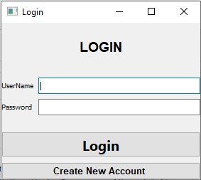
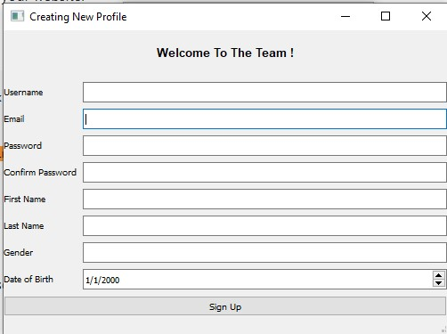
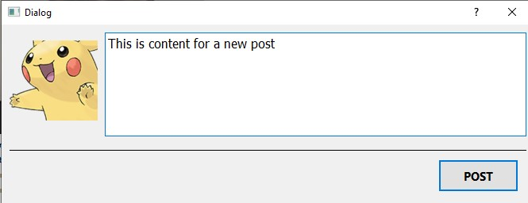
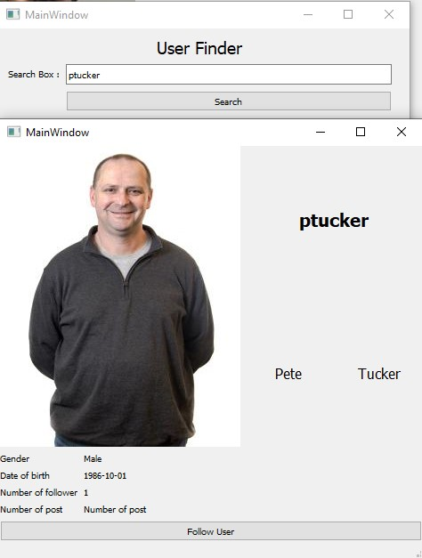
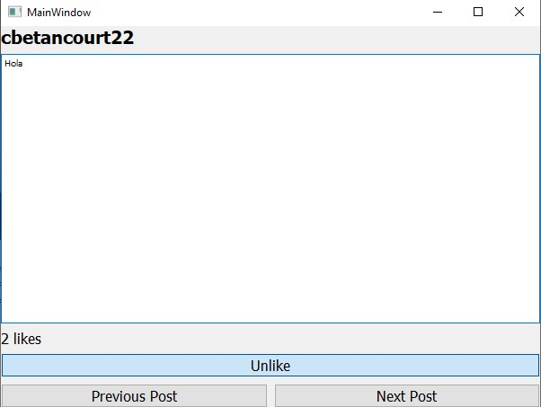
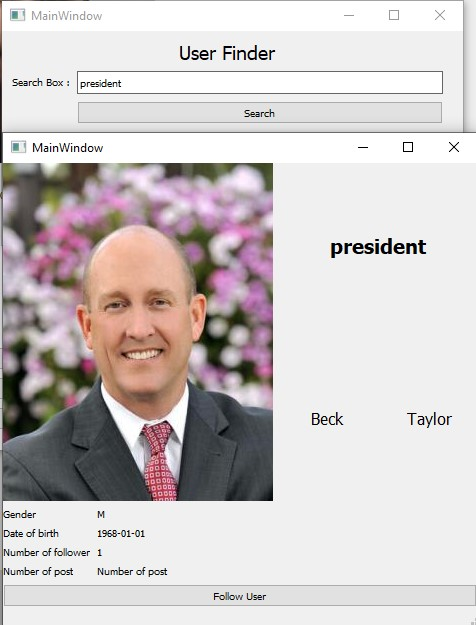

# Whitbook
CS374 - Intro to databasemanagement - Final project <br>
Group member: Phuc Cai, Bishesh Tuladhar, Xavier Betancourt, Nhatminh Nguyen <br>

## Project details
Detail description about the project can be found at: [./Documentation/ProjectDetails.docx] (/Documentation/ProjectDetails.docx)

## How to start the programs
The program can be start by running ./main.py

## Login and register
After starting the program, the user can choose to either login or register a new user

# Register
New user can register by giving some information like username, firstname, lastname and password<br>
> if registered using a Whitworth user name, the program will automatically pull the user profile image from Whitworth


## Login
After registering, user can login using the account the just created<br>
An username that you can use
```
Username: pcai22
Password: Whitworth123
```

## Create post
After loging in, user can see their own personal information and options to create new post, view other user post and make new post<br>
By clicking create post, there will be a window where user can input the content of their new post and post it.


## search and follow other user
User can also search for other user, view their information and follow them by selecting option **Search User**<br>


## View other people posts
After following other people, user can see and like other people post by selecting the option **View post feed**<br>
In this windows, the user can choose to **like** or unlike a post, see the **number of like** and **the content** as well as the author, and **scroll** to other post using the option of **next** and **previous post**.<br>


## Special feature
By registering to this application with Whitworth username, the application will automatically download their Whitworth profile picture and use it.<br>
An example here as Whitworth username of our president Beck Taylor is `president` 



